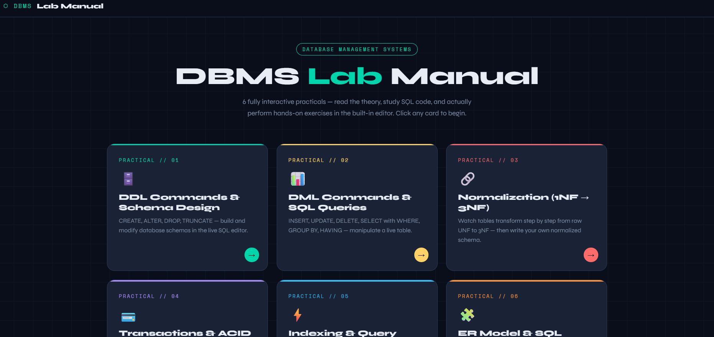

# 🚀 DBMS Lab Manual – Interactive Web Application

An advanced **interactive DBMS Lab Manual** designed for students to **learn, practice, and visualize database concepts** in a modern UI.

This project includes **6 fully interactive practicals**, live SQL editors, simulations, and quizzes — all in a single lightweight web app.

---

## 📸 Preview

---

## ✨ Features

### 🧪 6 Complete Practicals
1. DDL Commands & Schema Design  
2. DML Commands & SQL Queries  
3. Normalization (1NF → 3NF)  
4. Transactions & ACID Properties  
5. Indexing & Query Optimization  
6. ER Model & SQL Joins  

---

### 💻 Interactive Learning
- Live SQL Editor (DDL & DML simulation)
- Real-time table updates
- Task-based learning with checklist
- Built-in output console

---

### 📊 Visual Simulations
- Normalization step-by-step transformation
- Transaction (COMMIT / ROLLBACK) simulator
- ACID properties interactive cards
- Indexing vs Linear search demo

---

### 🧠 Quiz System
- Practice questions for each practical
- Instant feedback
- Score tracking

---

### 🎨 UI/UX Highlights
- Modern glassmorphism + dark theme
- Fully responsive design
- Smooth animations and transitions
- Clean typography (Space Mono + Syne)

---

## 🛠️ Tech Stack

- **HTML5**
- **CSS3 (Advanced UI + Animations)**
- **JavaScript (Vanilla)**

> No frameworks used — lightweight and fast ⚡

---
## 🎯 Learning Outcomes
After using this project, users can:
- Understand DDL & DML commands
- Perform SQL queries practically
- Learn Normalization deeply (1NF → 3NF)
- Visualize Transactions & ACID properties
- Understand Indexing & optimization
- Design ER models and joins
---

## 📌 Use Cases
- BCA / MCA / B.Tech students
- DBMS Lab practicals
- Viva preparation
- Self-learning SQL concepts
- Teaching/demo tool
---

## 📈 Future Improvements
- Backend integration (Node.js / MySQL)
- Real database connection
- User login system
- Save progress feature
- More advanced SQL support
---
## 👨‍💻 Author

**Yash Jain**
---

## 📄 License

This project is open-source and available under the MIT License.

